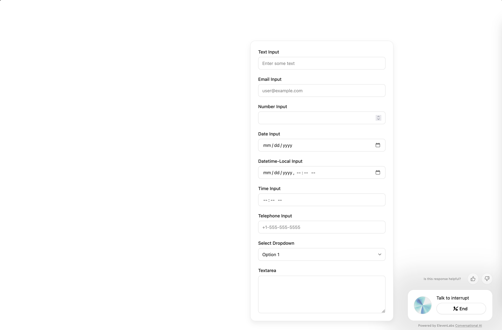

# Generative UI Forms for ElevenLabs Conversational AI

> **Note**: This is a community-created solution and is not affiliated with ElevenLabs. Use at your own discretion.

This package extends the ElevenLabs Conversational AI [Widget](https://elevenlabs.io/docs/conversational-ai/customization/widget) with dynamic form generation capabilities. It enables your AI agent to create, validate, and manage forms in real-time during conversations, providing a seamless way to collect structured data from users.



## Features

- 🎯 Dynamic form generation during conversations
- ✨ Beautiful, modern UI that matches ElevenLabs design
- ✅ Real-time validation with user-friendly messages
- 🎨 Pre-styled components that work out of the box
- 📱 Fully responsive design
- 🔒 Type-safe form schema

## Supported Field Types

- `text`: Single-line text input
- `email`: Email address input with validation
- `number`: Numeric input with optional min/max
- `date`: Date picker
- `datetime-local`: Date and time picker
- `time`: Time picker
- `tel`: Phone number input
- `select`: Dropdown with options
- `textarea`: Multi-line text input

## Usage

### Add the ElevenLabs Conversational AI widget to your page:

```html
<elevenlabs-convai agent-id="YOUR_AGENT_ID"></elevenlabs-convai>
<script src="https://elevenlabs.io/convai-widget/index.js" async></script>
```

### Add the Gen UI Forms script to your page:

```html
<script src="https://unpkg.com/11labs-community-gen-ui-forms"></script>
```

### Configure your agent to use the Gen UI Forms

To work forms require adding instructions to the system prompt and creating additional tools.

1. Add system prompt from [`config/prompt.md`](./config/prompt.md) to the end of your agent system prompt.
2. Add tools by calling API or manually on [ElevenLabs' Dashboard](https://elevenlabs.io/app/conversational-ai/agents):
- [`create_or_update_form`](./tools/create_or_update_form.json).
- [`get_form_state`](./tools/get_form_state.json).
- [`close_form`](./tools/close_form.json).

That's it! Your agent can now use forms to collect relevant information during conversations.

## Contributing

We welcome contributions! Please feel free to submit a Pull Request.

## License

Usage is provided under the MIT License. 
